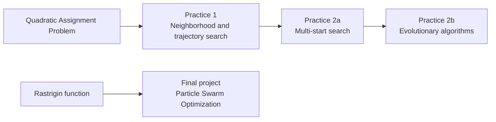
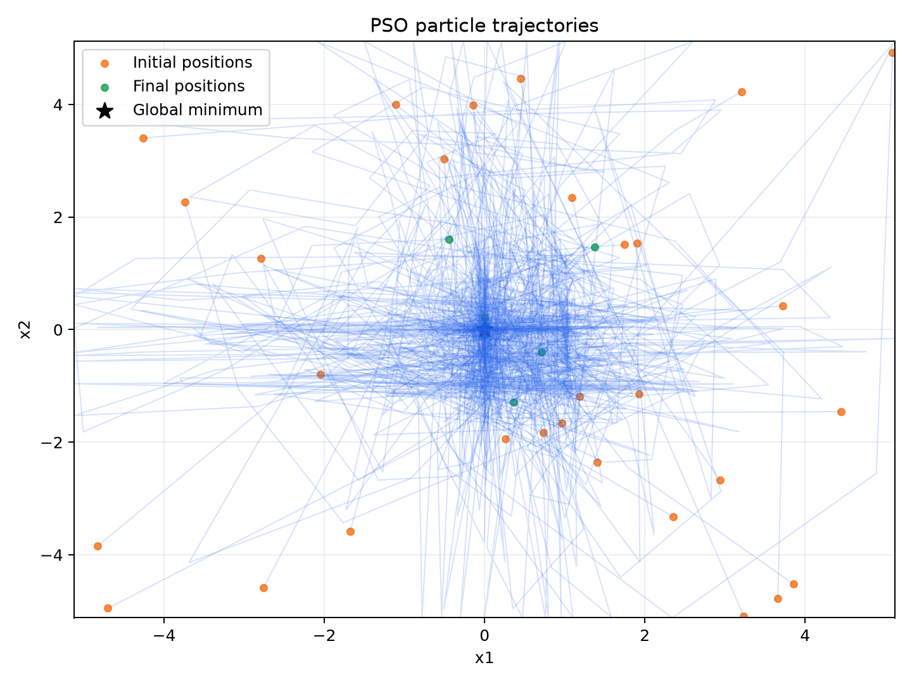

# Metaheuristic Optimization Labs

This repository presents a sequence of bio-inspired and trajectory-based optimization projects developed for the course *Bio-inspired Models and Search Heuristics*. The work starts from the Quadratic Assignment Problem (QAP) and progresses from neighborhood search to multi-start and evolutionary methods. The final project studies Particle Swarm Optimization (PSO) on the Rastrigin benchmark.

## Project map



| Activity | Problem | Methods |
| --- | --- | --- |
| Practice 1 | QAP | Greedy, Random Search, First and Best Improvement, Simulated Annealing, Tabu Search |
| Practice 2a | QAP | GRASP, Iterated Local Search, Variable Neighborhood Search |
| Practice 2b | QAP | Simple Genetic Algorithm, CHC, Multimodal GA with clearing |
| Final project | Rastrigin | Ring-topology PSO and best-neighbor Local Search |

The selected final project is PSO. The course also offered an Ant Colony Optimization assignment on the Traveling Salesman Problem as an alternative.

## Problems and data

The [QAP guide](docs/problems/qap.md) defines the assignment model, its objective function, the QAPLIB text format, and the three instances used throughout the course: `Tai25b`, `Sko90`, and `Tai150b`. The repository does not commit third-party QAPLIB data files. Follow [the data instructions](data/README.md) to download them from the source library.

The [Rastrigin guide](docs/problems/rastrigin.md) explains the multimodal continuous benchmark used by the final project, including its domain and global minimum.

The original Spanish course briefs are retained in the author's local archive and are not redistributed because their publication terms are unspecified. The repository provides [English assignment summaries](docs/assignments/README.md) covering the requirements needed to understand and reproduce the work.

## Algorithm guides

- [Neighborhood and trajectory methods](docs/algorithms/neighborhood-and-trajectory.md)
- [Multi-start methods](docs/algorithms/multistart.md)
- [Evolutionary methods](docs/algorithms/evolutionary.md)
- [Particle Swarm Optimization](docs/algorithms/pso.md)

Every guide includes the algorithm's purpose, workflow, parameters, stopping rule, main trade-offs, and a Mermaid flowchart.

## Run the project

The project requires Python 3.10 or later.

```bash
python -m venv .venv
# Windows
.venv\Scripts\activate
# macOS/Linux
source .venv/bin/activate

python -m pip install -e ".[dev]"
python scripts/fetch_qaplib.py --with-solutions
pytest
```

Run a short demonstration of each QAP activity:

```bash
python -m experiments.practice_1 --quick --dataset tai25b
python -m experiments.practice_2a --quick --dataset tai25b
python -m experiments.practice_2b --quick --dataset tai25b
```

Run the final project with the parameters specified in the assignment:

```bash
python -m experiments.final_pso --iterations 100 --runs 5 --output-dir results/generated/final-pso
```

Full QAP experiments can be expensive, especially on `Tai150b`. Omit `--quick` to use the assignment budgets.

## Reproducibility

- Algorithms use NumPy generators with explicit seeds.
- QAP permutations are zero-based in the Python implementation.
- Objective evaluations are counted consistently in every result.
- VNS performs exactly the requested number of local searches.
- PSO defaults to 100 updates, producing `30 + 100 x 30 = 3,030` objective evaluations.
- Automated tests check QAP costs, the O(n) swap delta, valid permutations, stopping budgets, and seeded repeatability.

## Results and reports

The [results overview](docs/results.md) summarizes the recorded experiments and explains the main findings. Supporting console output and convergence plots are under [`results/course-runs`](results/course-runs). The written reports are under [`reports/course-submissions`](reports/course-submissions).



## Repository structure

```text
assignments/es/        Source-brief policy and links to English summaries
data/                  Dataset instructions and local QAPLIB directory
docs/                   Problems, algorithms, assignments, results, and code guide
experiments/            Reproducible command-line entry points
reports/                Course reports
results/course-runs/    Recorded output and figures
scripts/                Dataset helper scripts
src/metaheuristics/     Reusable implementations
tests/                  Automated correctness checks
```

See the [implementation guide](docs/code-guide.md) for a file-by-file description.

## License

The original code and project documentation are released under the [MIT License](LICENSE). Third-party datasets and course materials are not covered by this license; consult their respective sources and terms.
