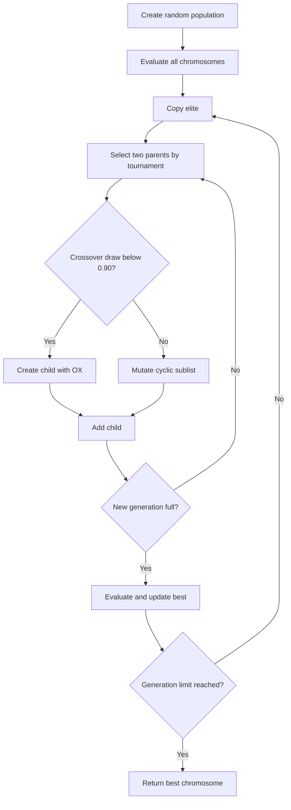
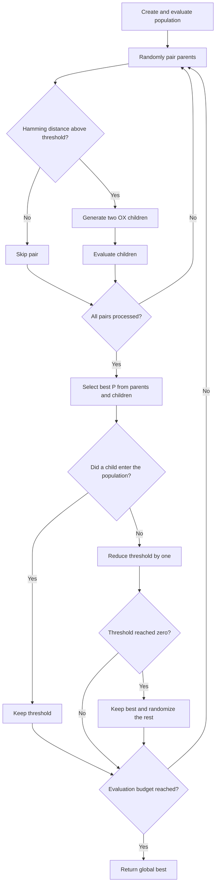
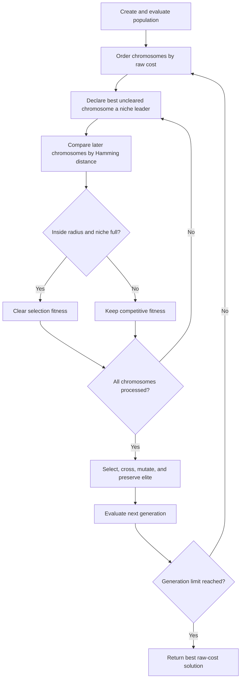

# Evolutionary algorithms

Practice 2b represents every QAP solution as a permutation chromosome. The evolutionary methods share tournament selection, order crossover, and cyclic-sublist mutation, but use different diversity controls.

## Shared operators

### Tournament selection

The algorithm samples `k` population members and selects the one with the lowest cost. The assignment sets `k` to 10 percent of the population. Larger tournaments increase selection pressure; smaller tournaments preserve more variety.

### Order crossover

OX copies a slice from the first parent and fills the remaining locations in the order in which genes appear in the second parent. Every facility and location therefore appears exactly once in the child.

### Cyclic-sublist mutation

Mutation chooses a random starting position and shuffles a fixed number of consecutive genes. The chromosome is circular, so the affected sublist may wrap around its final position.

## Simple Genetic Algorithm

The Simple GA uses generational replacement with one elite. It selects parents by tournament, applies OX with probability 0.90, and otherwise creates a mutated child. The course experiments use a population of 190 and 1,000 generations.

With population `P`, generations `G`, and a full QAP evaluation, the main cost is O(G x P x n²). The algorithm exploits good building blocks effectively, but its population can converge early if selection pressure is too high or mutation is too weak.

Implementation: `simple_genetic_algorithm` in `src/metaheuristics/evolutionary.py`.

## CHC

CHC prevents similar parents from crossing. Two permutations may recombine only when their Hamming distance exceeds a threshold initially set to `n / 4`. Parents and children compete in an elitist survival step.

CHC does not mutate during ordinary recombination. When the threshold reaches zero, it restarts the population around the best chromosome: the elite is copied and all remaining members are randomized. The convergence history marks these restarts explicitly.

Implementation: `chc_genetic_algorithm` in `src/metaheuristics/evolutionary.py`.

## Multimodal Genetic Algorithm

The multimodal version applies clearing after evaluation. Chromosomes are ordered by cost; the best becomes a niche leader, while later solutions inside its Hamming radius lose selection fitness after the niche reaches capacity. The population itself stays intact.

The course implementation uses a Hamming radius of 3 and niche capacity 1. Clearing reduces domination by a single cluster and encourages several parts of the search space to remain represented. If the radius is too small it has little effect; if it is too large it suppresses useful competitors.

Implementation: `multimodal_genetic_algorithm` in `src/metaheuristics/evolutionary.py`.
