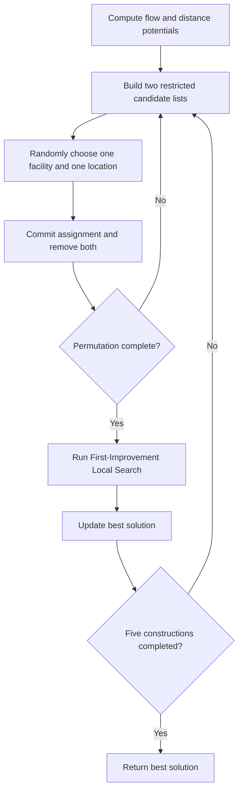
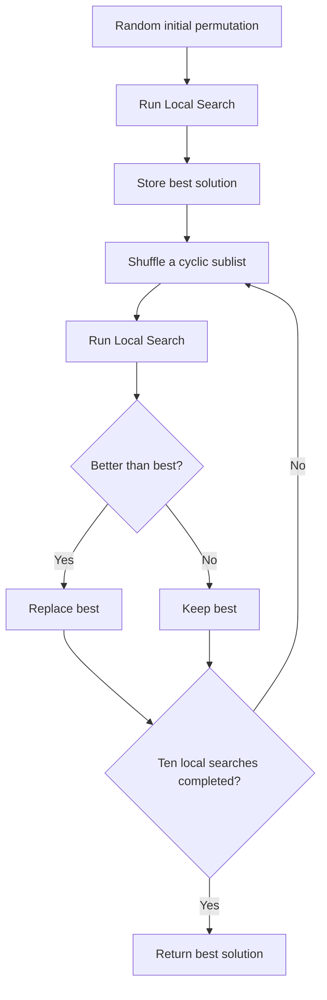
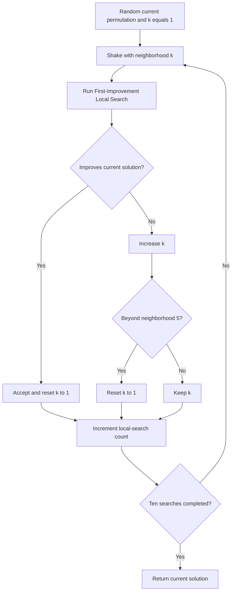

# Multi-start algorithms

Practice 2a combines diversification mechanisms with First-Improvement Local Search. The shared idea is to generate several promising starting regions, refine each candidate, and retain the best solution.

## GRASP

GRASP alternates a randomized greedy construction with local improvement. At each construction step, it forms two restricted candidate lists: high-flow facilities and low-distance locations. It randomly chooses one item from each list and commits that assignment.

The assignment uses five constructions and restricted lists of size `l = 0.1 x n`. Smaller lists make construction greedier; larger lists increase diversity. GRASP performs one reported run per QAP instance because each run already contains multiple starts.

Implementation: `grasp` in `src/metaheuristics/multistart.py`.

## Iterated Local Search

ILS begins from a random permutation, reaches a local optimum, then repeatedly perturbs the best solution and applies Local Search again. The acceptance rule keeps the better of the incumbent and the newly improved solution.

The strong perturbation randomly reorders a cyclic sublist of size `n / 4`. The algorithm applies Local Search ten times: once to the initial solution and nine times after perturbation. Best-so-far acceptance provides stable improvement but can reduce exploration when perturbations repeatedly return to the same basin.

Implementation: `iterated_local_search` in `src/metaheuristics/multistart.py`.

## Variable Neighborhood Search

VNS changes the perturbation strength when the current neighborhood fails. An improvement resets the neighborhood index to one; a failure advances to the next neighborhood.

The five cyclic-sublist sizes are `n/8`, `n/7`, `n/6`, `n/5`, and `n/4`. The implementation uses one bounded loop, so exactly ten local searches are performed. Five independent VNS runs support mean, standard deviation, relative error, and coefficient-of-variation analysis.

Implementation: `variable_neighborhood_search` in `src/metaheuristics/multistart.py`.
