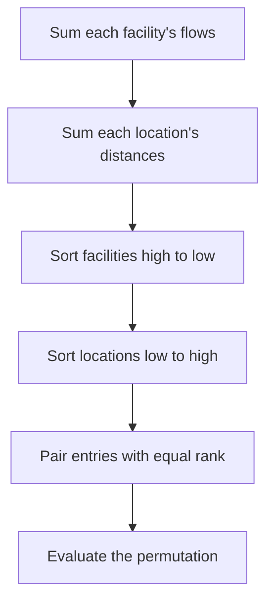
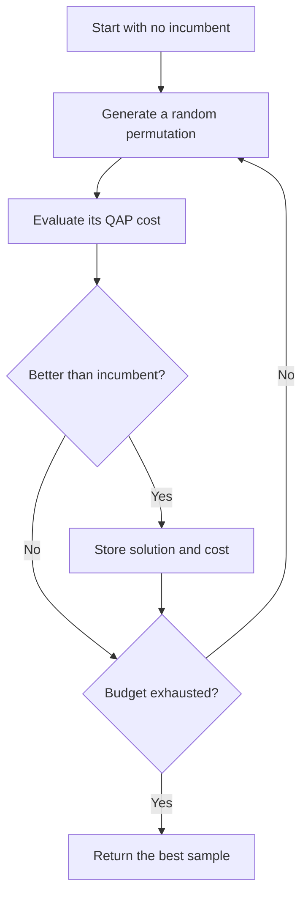
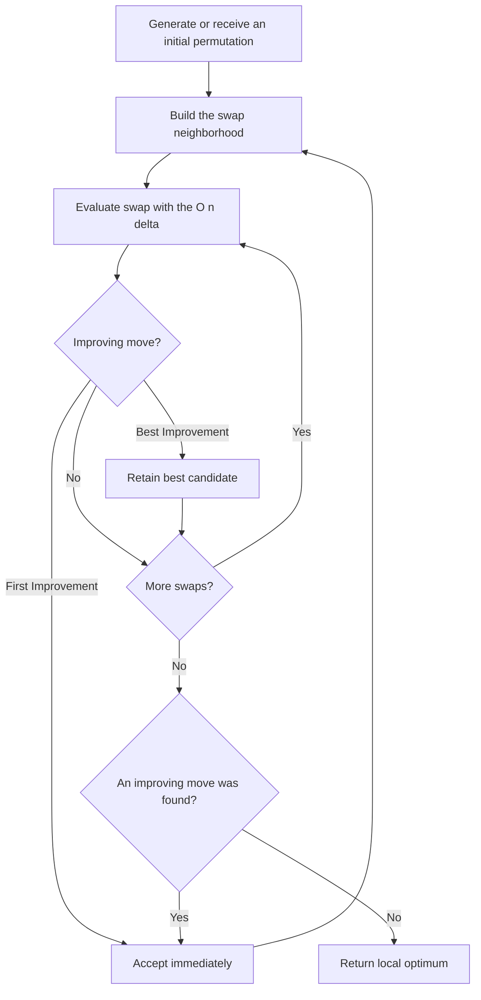
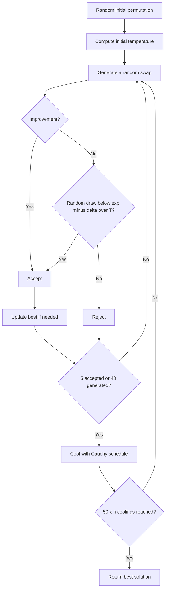
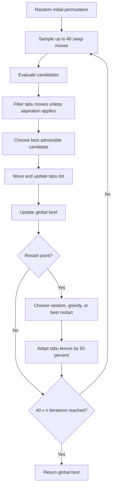

# Neighborhood and trajectory algorithms

Practice 1 compares simple baselines with methods that move through the QAP search space. Every candidate is a permutation, and a neighbor is created by swapping the locations assigned to two facilities.

## Greedy construction

Greedy construction gives a deterministic reference solution. It computes the total flow of every facility and the total distance from every location. The highest-flow facility is paired with the most central remaining location, then the process continues in sorted order.

The construction is fast and reproducible, but it considers potentials independently and cannot anticipate all pairwise interactions. Matrix summation costs O(n²); sorting costs O(n log n).

Implementation: `greedy_qap` in `src/metaheuristics/neighborhood.py`.

## Random Search

Random Search samples independent permutations and returns the least expensive one. It provides a lower baseline for measuring whether an informed search strategy adds value.

The assignment budget is `1000 x n` samples and five seeded runs per instance. With full O(n²) evaluation, the running time is O(samples x n²).

Implementation: `random_search` in `src/metaheuristics/neighborhood.py`.

## First- and Best-Improvement Local Search

Both methods explore the 2-opt neighborhood containing `n(n-1)/2` swaps. They differ in when they accept a move:

- First Improvement accepts the first improving neighbor in the chosen order.
- Best Improvement evaluates the complete neighborhood and accepts the greatest improvement.

First Improvement usually evaluates fewer candidates per accepted move. Best Improvement spends more work per step but chooses the strongest available descent. Both stop when no swap improves the current permutation. The O(n) delta calculation reduces one neighborhood scan from O(n⁴) with naive full recomputation to O(n³).

Implementation: `local_search` in `src/metaheuristics/neighborhood.py`.

## Simulated Annealing

Simulated Annealing can accept a worse neighbor with probability `exp(-delta / T)`. This allows early exploration across local barriers. The Cauchy schedule gradually reduces the temperature and makes the search increasingly selective.

The assignment uses `mu = 0.3`, `phi = 0.3`, at most 5 accepted or 40 generated neighbors per temperature, and `50 x n` cooling steps. Its main trade-off is controlled diversification: high temperature helps escape local minima, while low temperature focuses on exploitation.

Implementation: `simulated_annealing` in `src/metaheuristics/neighborhood.py`.

## Tabu Search

Tabu Search selects the best admissible move from a sample of 40 swaps. A short-term list prevents recently used moves from being repeated. Aspiration allows a tabu move when it improves the best solution seen in the whole run.

The run lasts `40 x n` iterations with restarts every `8 x n` iterations. Restart probabilities are 0.25 for a random solution, 0.50 for a greedy solution, and 0.25 for the best solution. The tabu tenure starts at `n / 2` and changes by plus or minus 50 percent after each restart.

If every sampled move is tabu, the implementation temporarily relaxes the restriction and selects the best sampled move. This preserves a valid trajectory without disabling aspiration or the tabu memory.

Implementation: `tabu_search` in `src/metaheuristics/neighborhood.py`.
