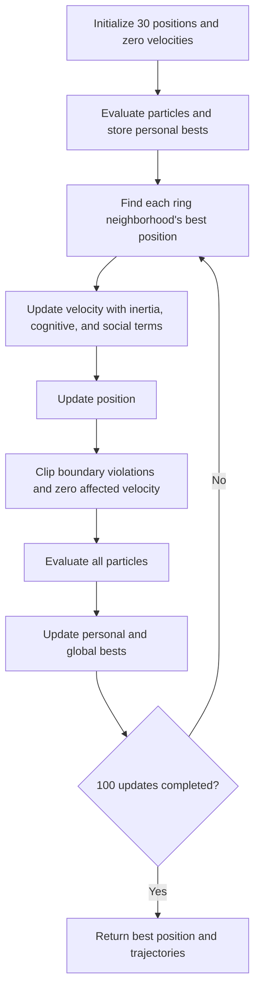
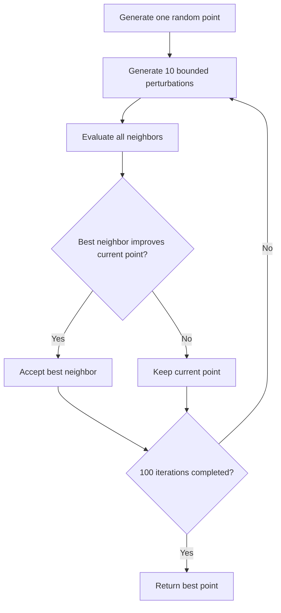

# Particle Swarm Optimization

The final project compares Particle Swarm Optimization with best-neighbor Local Search on the two-dimensional Rastrigin function.

## Particle model

Particle `i` stores its position `x_i`, velocity `v_i`, personal best `p_i`, and best position `g_i` known in its ring neighborhood. Each update is:

```math
v_i \leftarrow wv_i + c_1r_1(p_i-x_i) + c_2r_2(g_i-x_i)
```

```math
x_i \leftarrow x_i + v_i
```

The inertia term preserves motion. The cognitive term returns the particle toward its own best experience. The social term pulls it toward the best location known by nearby particles.

## PSO workflow



The parameters are:

| Parameter | Value |
| --- | ---: |
| Particles | 30 |
| Inertia `w` | 0.7 |
| Cognitive coefficient `c1` | 1.5 |
| Social coefficient `c2` | 1.5 |
| Ring radius | 2, giving four neighbors plus the particle itself |
| Domain | `[-5.12, 5.12]^2` |
| Updates | 100 |

One run evaluates the 30 initial positions and 30 positions after each update, for `30 + 100 x 30 = 3,030` objective evaluations. The dominant computational cost is O(iterations x particles x dimensions), excluding visualization.

Implementation: `particle_swarm_optimization` in `src/metaheuristics/pso.py`.

## Local Search baseline

The baseline starts from one random point. Each iteration generates ten points by perturbing every coordinate by at most 0.1, evaluates them, and accepts the best candidate only if it improves the current point.



The method performs `1 + 100 x 10 = 1,001` evaluations. It is inexpensive and useful for refinement, but its short moves and single trajectory make it sensitive to the starting basin on a highly multimodal surface.

Implementation: `local_search_rastrigin` in `src/metaheuristics/pso.py`.

## Exploration and exploitation

The ring topology spreads information gradually, which preserves more exploration than a fully connected swarm. As particles improve, the cognitive and social terms concentrate the swarm around promising basins. Local Search has no information-sharing mechanism and cannot cross a worse region to reach a distant basin.

The two supplied figures show this behavior from complementary perspectives:

- [Particle trajectories in the plane](../../results/reference/final-pso/particle-trajectories-2d.png)
- [Particle trajectories on the Rastrigin surface](../../results/reference/final-pso/particle-trajectories-3d.png)
